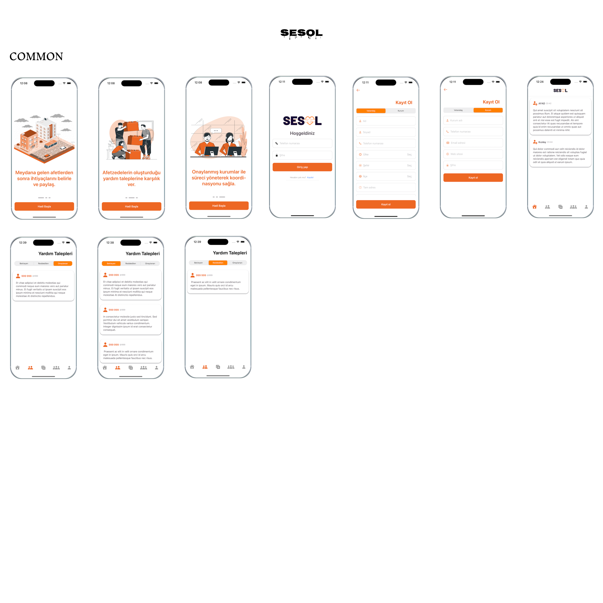
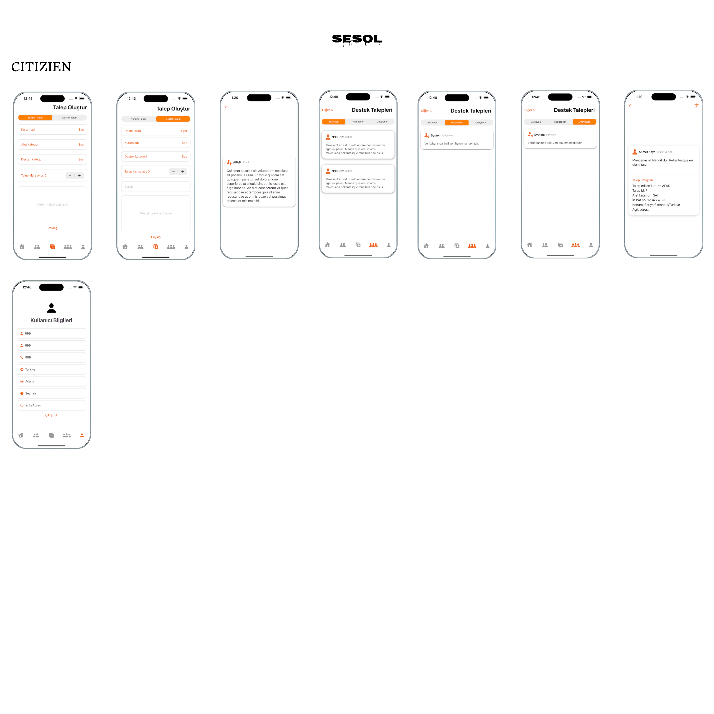
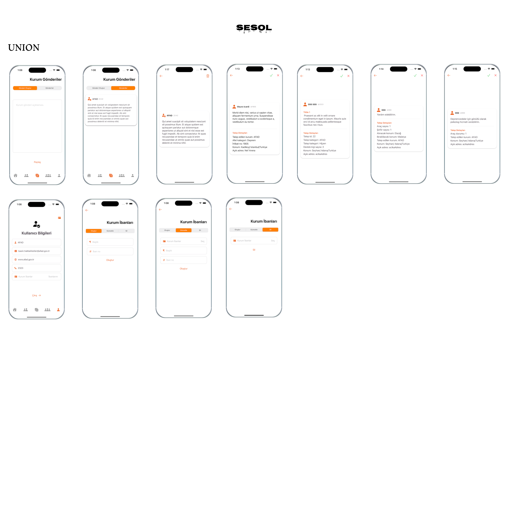
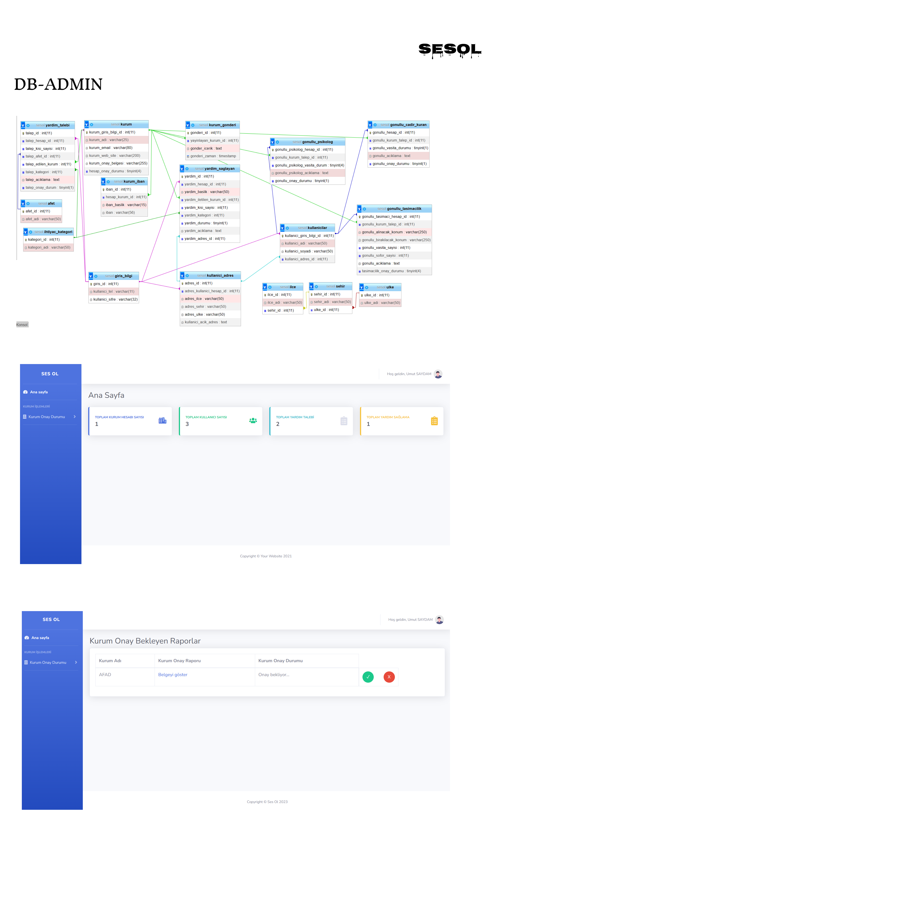

# SesOl
Yazılım mühendisliği dersi kapsamında , meydana gelen doğal afetlerden sonra koordinasyonu sağlamak ve afetzedelere yardımların direkt ulaşmasını amaçlayan mobil uygulama geliştiriyoruz.

## Built With
- [Swift](https://developer.apple.com/swift/)
- [SwiftUI](https://developer.apple.com/xcode/swiftui/)

  

  

  

  

