# SesOlSwiftUI
Yazılım mühendisliği dersi kapsamında , meydana gelen doğal afetlerden sonra koordinasyonu sağlamak ve afetzedelere yardımların direkt ulaşmasını amaçlayan mobil uygulama geliştiriyoruz.

## Ana Ekranlar

### OnBoard Ekranı

    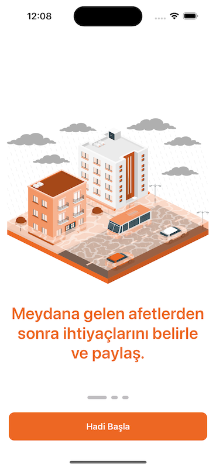
    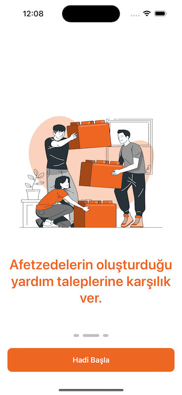
    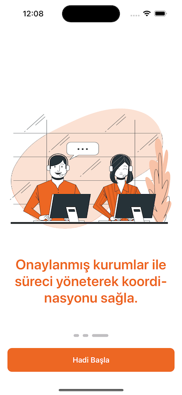

### Giriş & Kayıt Ekranı

    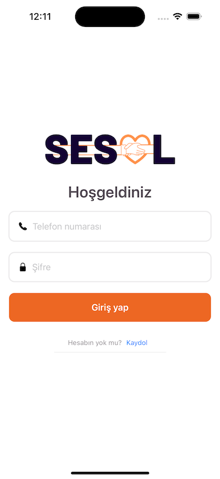
    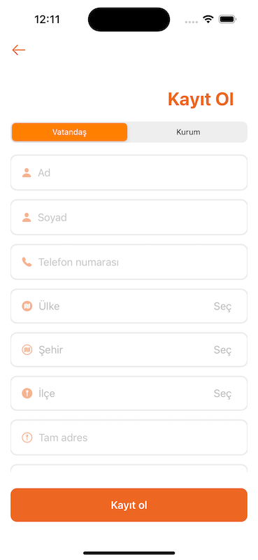
    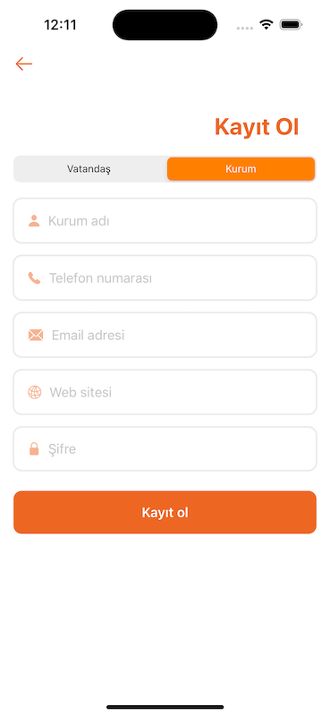

### Vatandaş Ekranları

#### Anasayfa

    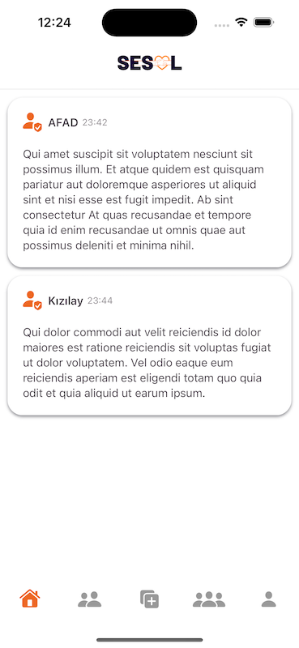

#### Yardım Talepleri

    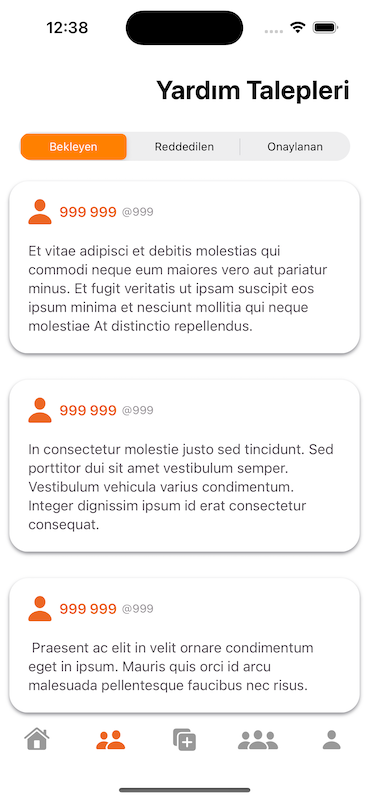
    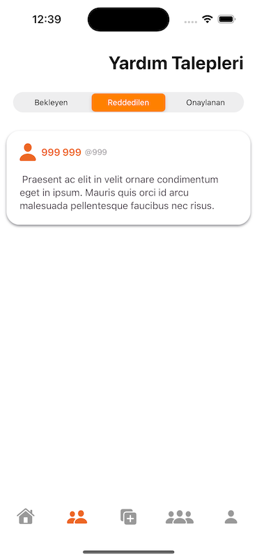
    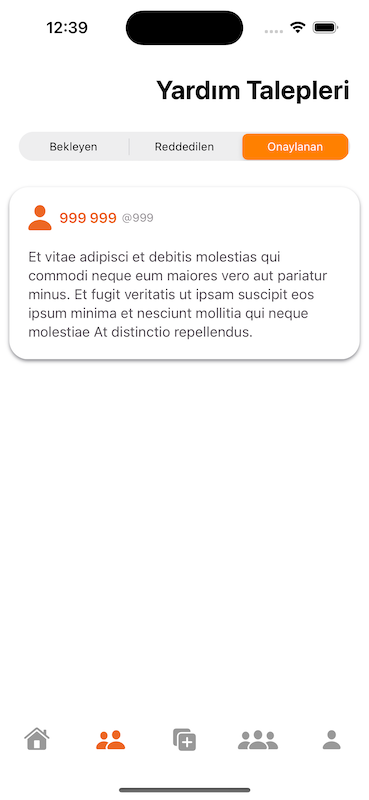

#### Yardım ve Destek Talebi Oluşturma Ekranı

    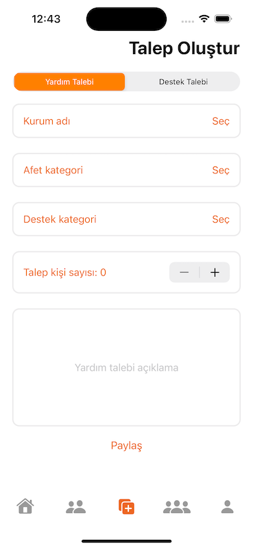
    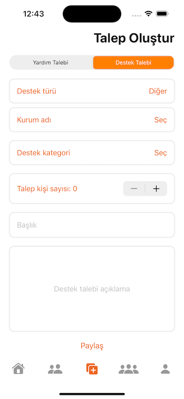

#### Destek Talepleri

    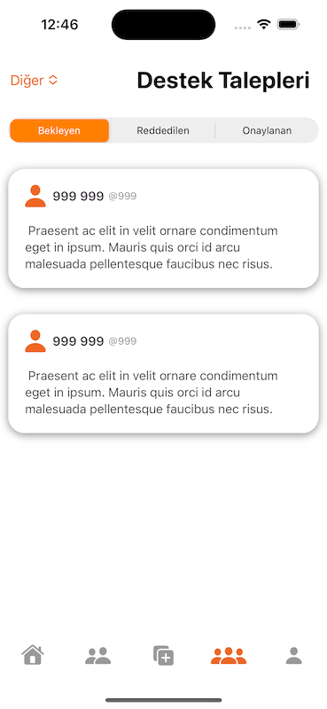
    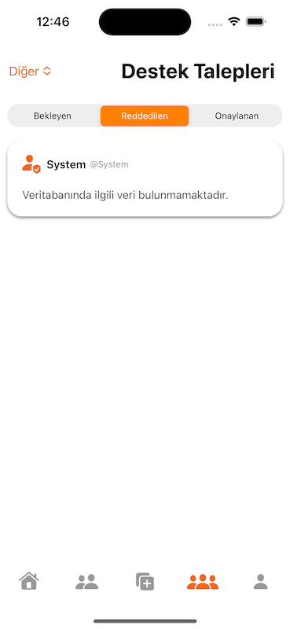
    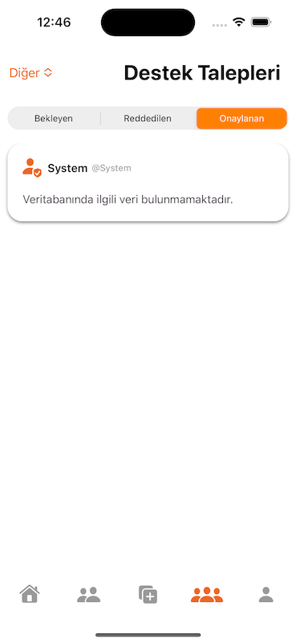

#### Profil

    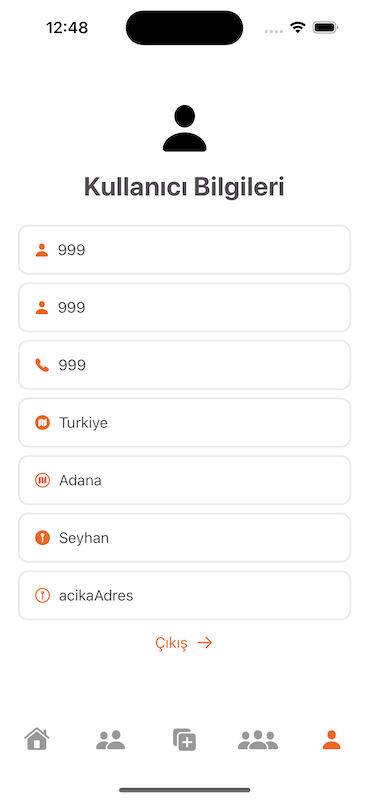

#### Talep Detay Ekranı

    

#### Kurum Gönderi Detay Ekranı

    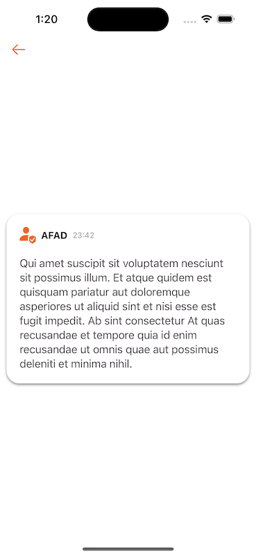

### Kurum Ekranları

#### Anasayfa

    

#### Yardım Talepleri!

    
    
    

#### Gönderi Oluşturma Ekranı

    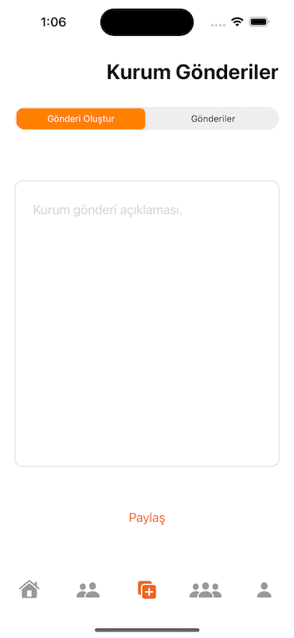
    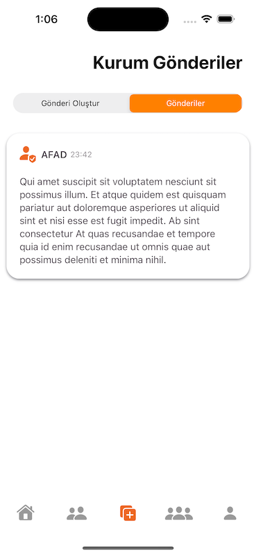

#### Destek Talepleri

    
    
    

#### Profil

    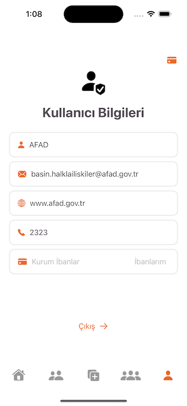
    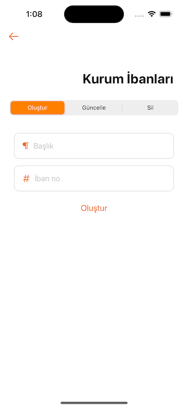
    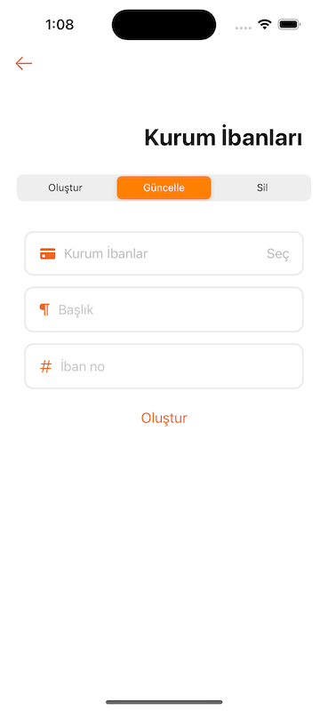
    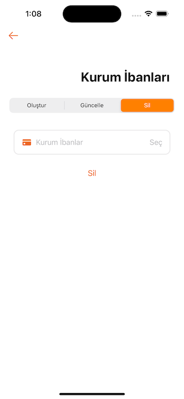

#### Talep Detay Ekranı

    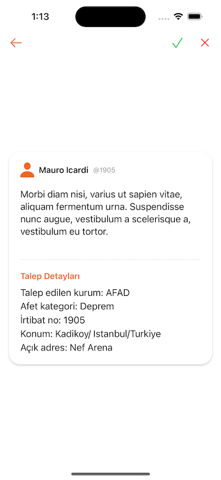
    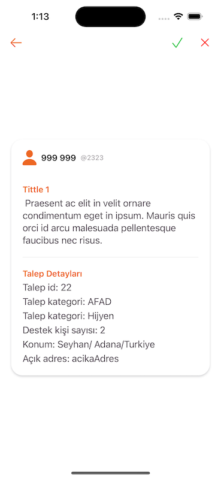
    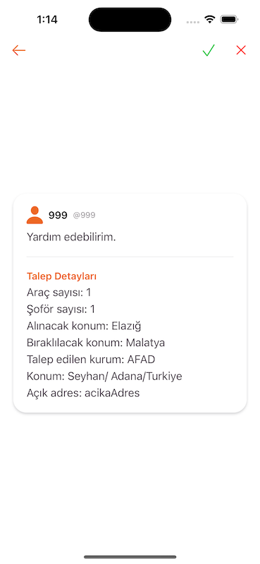
    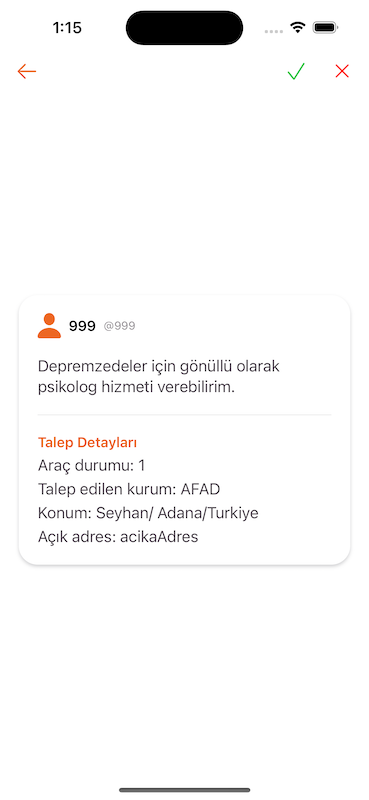

#### Gönderi Detay Ekranı

    

### Kurum Onaylama Paneli

    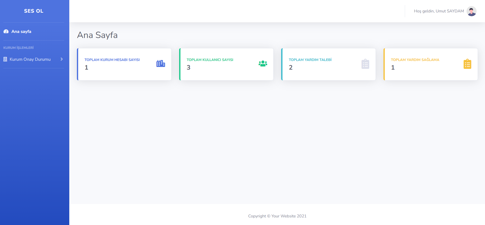
    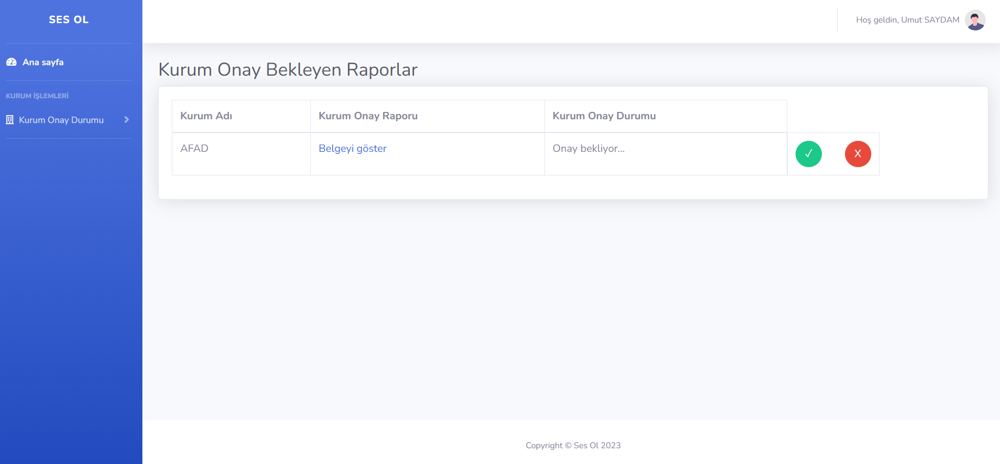

### Veri Tabanı Şeması

    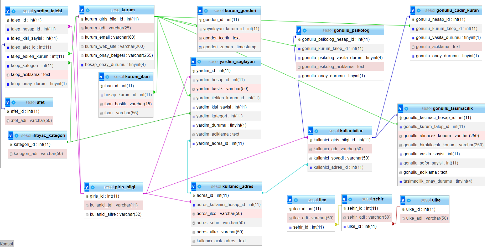

